# Отчёт по практической работе
**Тема:** Bash lab 1
**Выполнил:** Дикарёв Ефим
**Группа:** 324к

---

## Шаг 1 zero.sh

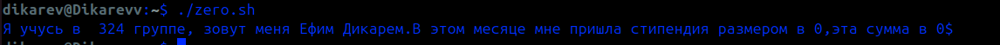

*Рисунок 1 – zero.sh*

## Шаг 2. start.sh

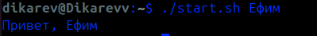

*Рисунок 2 – start.sh*

## Шаг 3. start_2.sh

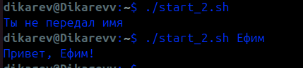

*Рисунок 3 – start_2.sh

## Шаг 4. file.sh

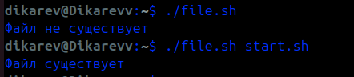

*Рисунок 4 – file.sh

## Шаг 5. my_dir.sh

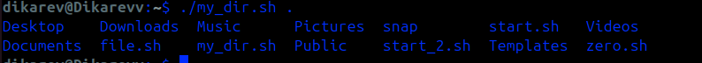

*Рисунок 5 – my_dir.sh

## Шаг 6. dir_m.sh

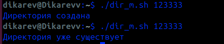

*Рисунок 6 – dir_m.sh
## Шаг 7. user_light.sh

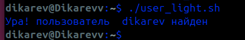

*Рисунок 7 – user_light.sh

## Шаг 8. user_f.sh

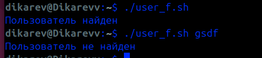

*Рисунок 8 – user_f.sh*

## Шаг 9. user_f2.sh

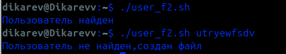

*Рисунок 9 - user_f2.sh*
### Шаг 10. findre_light.sh

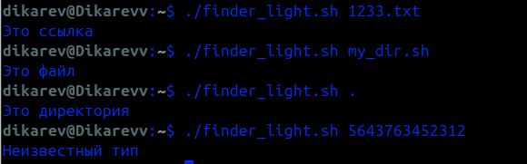

*Рисунок 10 – finder_light.sh

## Шаг 11. math.sh

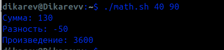

*Рисунок 11 – math.sh*

### Шаг 12. sort.sh

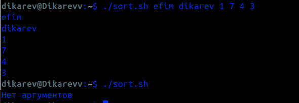

*Рисунок 12 – sort.sh*

## Шаг 13. io.sh

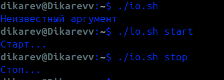

*Рисунок 13 – io.sh*

## Шаг 14. user_use.sh

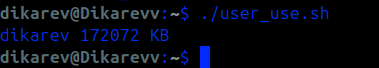

*Рисунок 14 – user_use.sh*

### Шаг 15. sort_du.sh

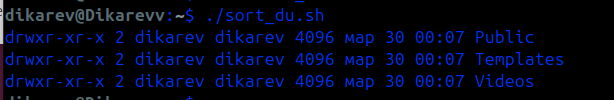

*Рисунок 15 - sort_du.sh*

## Шаг 16. dir_info.sh

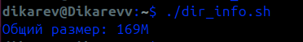

*Рисунок 16 – dir_info.sh*

## Шаг 17. bash_history.sh

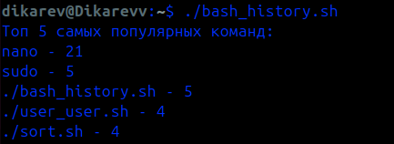

*Рисунок 17 – bash_history.sh

