# Отчёт по практической работе
## «Configure WAN part 2»
**Выполнил:** Дикарёв Ефим 
**Группа:** 324к

---

# Часть 1. Построение сети и базовая настройка

## Шаг 1. Построение топологии

Сеть собрана в Cisco Packet Tracer согласно приложенной схеме:

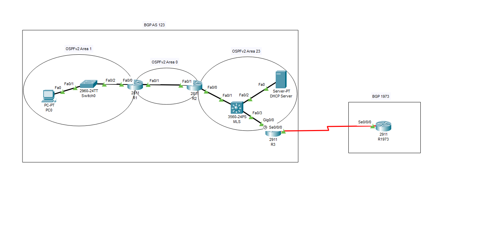

*Рисунок 1 – Схема сети*

## Шаг 2. Базовая настройка R1

На маршрутизаторе R1 настроены интерфейсы FastEthernet0/0 и FastEthernet0/1 с соответствующими IP-адресами:

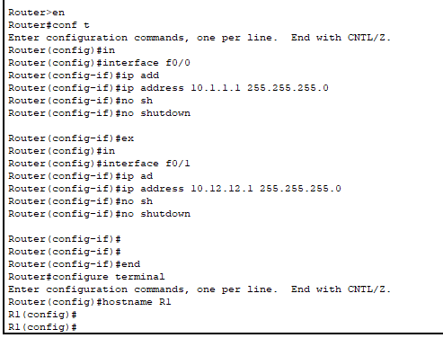

*Рисунок 2 – Конфигурация интерфейсов R1*

## Шаг 3. Базовая настройка R2

На R2 аналогично настроены интерфейсы:

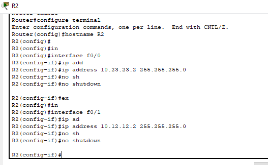

*Рисунок 3 – Конфигурация интерфейсов R2*

## Шаг 4. Базовая настройка R3

На R3 созданы loopback-интерфейсы и настроены физические порты:

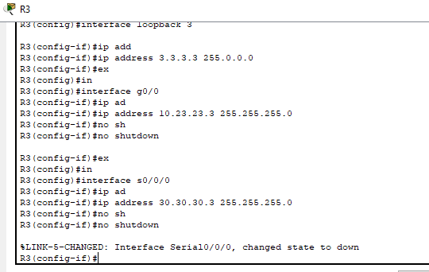

*Рисунок 4 – Конфигурация интерфейсов R3*

## Шаг 5. Базовая настройка R1973

На R1973 создан loopback-интерфейс 1973 и настроен последовательный порт:

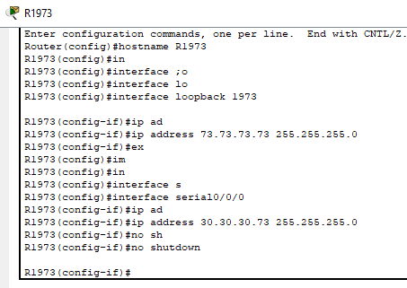

*Рисунок 5 – Конфигурация интерфейсов R1973*

---

# Часть 2. Настройка PPP с аутентификацией CHAP

## Шаг 1. Настройка последовательных интерфейсов

Для организации защищённого канала между R3 и R1973 используется протокол PPP с аутентификацией CHAP. Пароль установлен одинаковым на обоих устройствах.

**Параметры аутентификации:**
- Username на R3: R1973
- Username на R1973: R3
- Пароль: CiscoCHAP123

### Конфигурация R3

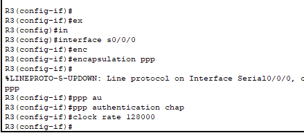

*Рисунок 6 – Настройка PPP и CHAP на R3*

### Конфигурация R1973

.png)

*Рисунок 7 – Настройка PPP и CHAP на R1973*

## Результат проверки

После настройки проверяем состояние интерфейса и связность:

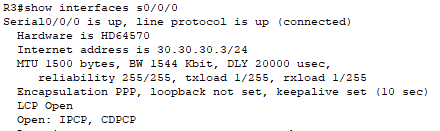

*Рисунок 8 – Статус LCP Open на R3*

---

# Часть 3. Настройка OSPFv2

## Конфигурация OSPF на маршрутизаторах

### R1

На R1 настроен процесс OSPF 100 с указанием зон:

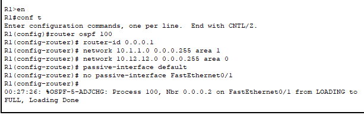

*Рисунок 9 – Конфигурация OSPF на R1*

### R2

На R2 задан router-id 0.0.0.2 и повышен приоритет для выбора DR:

.png)

*Рисунок 10 – Конфигурация OSPF на R2*

### R3

На R3 добавлены сети loopback-интерфейсов и настроена отправка маршрута по умолчанию:

.png)

*Рисунок 11 – Конфигурация OSPF на R3*

---

# Часть 4. Настройка BGP

## Конфигурация BGP между R3 и R1973

### R3 (AS 3)

### R1973 (AS 1973)

.png)

*Рисунок 12 – Конфигурация BGP на R1973*

---

# Часть 5. Установка лицензий

## Шаг 1-5. Настройка лицензий на R3

На R3 активированы лицензионные пакеты для VoIP и безопасности:

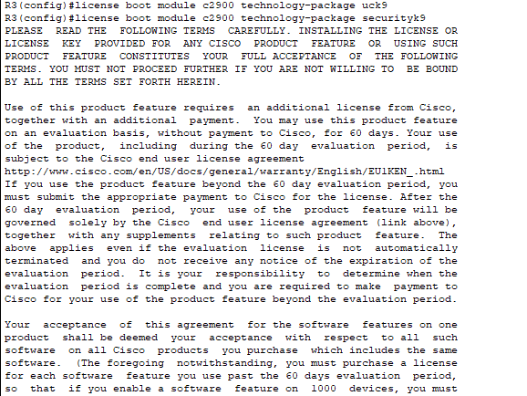

*Рисунок 13 – Установка лицензий на R3*

.png)

*Рисунок 14 – Подтверждение лицензионного соглашения*

.png)

*Рисунок 15 – Перезагрузка маршрутизатора*

---

# Часть 6. Настройка DHCP-ретранслятора

## Шаг 1. Настройка R1

На интерфейсе FastEthernet0/0 R1 настроен помощник DHCP:

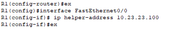

*Рисунок 16 – Конфигурация DHCP-ретранслятора на R1*

## Шаг 2. Результат на PC0

После настройки PC0 успешно получает IP-адрес от DHCP-сервера:

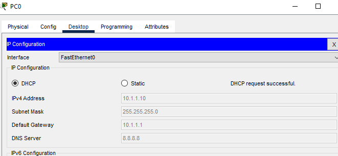

*Рисунок 17 – PC0 получил IP-адрес 10.1.1.10*

---

# Часть 7. Настройка IPv6-адресов

## Конфигурация IPv6 на маршрутизаторах

### R1

.png)

*Рисунок 18 – Конфигурация IPv6 на R1*

### R2

.png)

*Рисунок 19 – Конфигурация IPv6 на R2*

### R3

.png)

*Рисунок 20 – Конфигурация IPv6 на R3*

### R1973

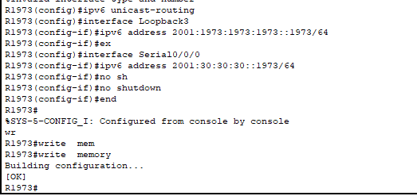

*Рисунок 21 – Конфигурация IPv6 на R1973*

---

# Часть 8. Настройка OSPFv3

## Конфигурация OSPFv3

### R1

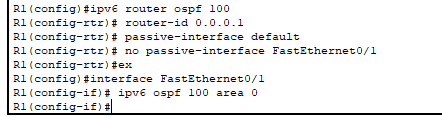

*Рисунок 22 – Конфигурация OSPFv3 на R1*

### R2

.png)

*Рисунок 23 – Конфигурация OSPFv3 на R2*

### R3

.png)

*Рисунок 24 – Конфигурация OSPFv3 на R3*

---

# Часть 9. Настройка EIGRPv6

## Конфигурация EIGRPv6 между R3 и R1973

### R3

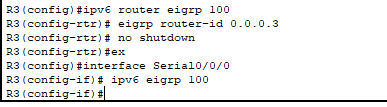

*Рисунок 25 – Конфигурация EIGRPv6 на R3*

### R1973

.png)

*Рисунок 26 – Конфигурация EIGRPv6 на R1973*

---

# Заключение

В ходе выполнения практической работы были последовательно настроены следующие компоненты сети:

1. Базовая IP-адресация всех маршрутизаторов
2. PPP-соединение с аутентификацией CHAP на последовательном канале
3. Динамическая маршрутизация OSPFv2 для IPv4
4. Внешний протокол BGP между автономными системами 3 и 1973
5. Лицензирование функций VoIP и безопасности на R3
6. DHCP-ретрансляция для автоматической выдачи адресов клиентам
7. IPv6-адресация на всех сетевых устройствах
8. Протокол OSPFv3 для маршрутизации IPv6
9. EIGRPv6 для обмена маршрутами между R3 и R1973

Все настроенные протоколы функционируют корректно, что подтверждается результатами проверок связности между узлами.

---

