# Отчёт по практической работе  
## «Configure LAN part 1»

**Выполнил:** Дикарёв Ефим  
**Группа:** 324К   

---

## Часть 1. Базовая настройка сети (Новосибирск)

### Шаг 1. Построение топологии
В среде эмуляции Cisco Packet Tracer собрана сеть, включающая маршрутизаторы R1, R2, R3, многоуровневый коммутатор MLS, коммутаторы доступа SW0 и SW1, оконечные устройства PC0, PC2, PC6 и сервер Server-PT.

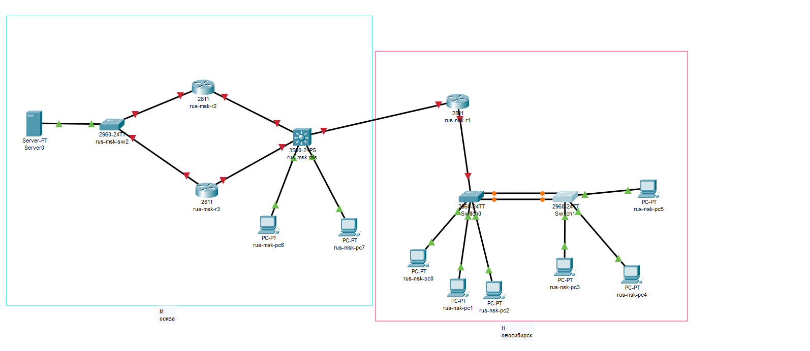

*Рисунок 1 – Схема собранной топологии*

---

### Шаг 2. Настройка приветственного сообщения (MOTD)
На каждом сетевом устройстве настроено баннерное сообщение, содержащее фамилию, имя, номер группы и порядковый номер в журнале.

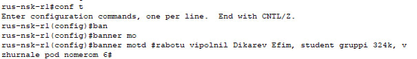

*Рисунок 2 – Приветственное сообщение на R1*

---

### Шаг 3. Присвоение имён устройствам
Всем устройствам заданы имена в соответствии с шаблоном: `страна-город-роль+номер`.  
Для Новосибирска — `rus-nsk-sw0`, `rus-nsk-sw1`.  
Для Москвы — `rus-msk-r1`, `rus-msk-r2`, `rus-msk-r3`, `rus-msk-mls`.

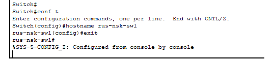

*Рисунок 3 – Имя коммутатора SW1*

---

### Шаг 4. Назначение доменных имён
Для устройств в Новосибирске установлен домен `nsk.local`, для московских устройств — `msk.local`.

*Рисунок 4 – Доменное имя на коммутаторе SW0*

---

### Шаг 5. Создание VLAN на коммутаторах
На SW0 и SW1 созданы виртуальные сети VLAN 2, 3 и 4 без указания имён.

*Рисунок 5 – Таблица VLAN на коммутаторе SW0*

---

### Шаг 6. Распределение портов по VLAN
Порты FastEthernet 0/2, 0/3 и 0/4 назначены в соответствующие VLAN (2, 3 и 4) в режиме access.

*Рисунок 6 – Порты доступа на SW0*

---

### Шаг 7. Организация EtherChannel
Между SW0 и SW1 сформирован агрегированный канал EtherChannel второго уровня с использованием протокола PAgP. Логический канал Port-Channel 1 настроен как транк.

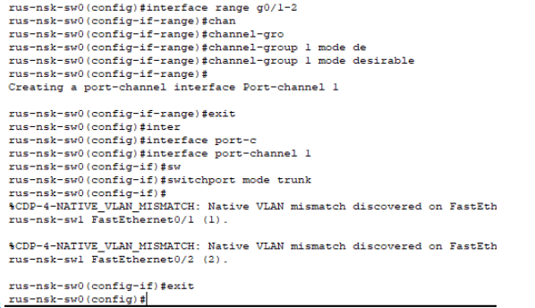

*Рисунок 7 – Статус агрегированного канала*

---

### Шаг 8. Настройка управления на SW0 (VLAN 1)
Для удалённого доступа к SW0 создан интерфейс VLAN 1 с IP-адресом 1.0.0.50/8. Указан шлюз по умолчанию 1.0.0.1.

*Рисунок 8 – Интерфейс VLAN 1 на SW0*

---

### Шаг 9. Настройка управления на SW1 (VLAN 2)
На SW1 интерфейс VLAN 2 получил адрес 2.0.0.50/8, шлюз по умолчанию — 2.0.0.1.

*Рисунок 9 – Интерфейс VLAN 2 на SW1*

---

### Шаг 10. Активация SSHv2
Сгенерированы RSA-ключи, создана локальная учётная запись `nsk` с паролем `cisco`. На линиях VTY разрешено только SSH-подключение.

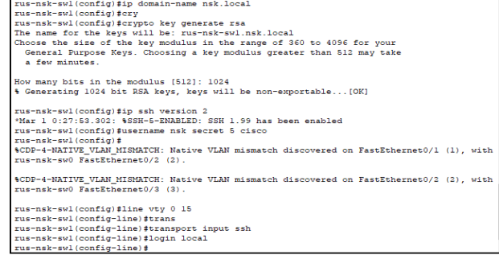

*Рисунок 10 – Настройки SSH на SW1*

---

### Шаг 11. Настройка транка на SW0
Порт Fa0/24, соединяющий SW0 с маршрутизатором R1, переведён в режим trunk.

*Рисунок 11 – Конфигурация порта Fa0/24 SW0*

---

### Шаг 12. Приветственное сообщение для SW0 и SW1
Для каждого коммутатора задано баннерное сообщение, отображающее его имя при подключении.

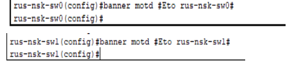

*Рисунок 12 – Приветствие SW1*

---

### Шаг 13. Настройка безопасности портов
На портах Fa0/2–4 включены функции PortFast, BPDUguard, отключён CDP, активирована PortSecurity с запоминанием MAC-адреса.

.png)

*Рисунок 13 – Параметры port-security на порту Fa0/3*

---

### Шаг 14. Защита консольного доступа
Для входа через консоль настроена аутентификация по локальной базе пользователей.

*Рисунок 14 – Параметры line console*

---

### Шаг 15. Отключение таймаута сессии
Для консольного и VTY-подключений отключён автоматический разрыв сессии по таймауту.

*Рисунок 15 – Отключение exec-timeout*

---

### Шаг 16. Синхронизация вывода сообщений
На консольной линии включена синхронизация логов, чтобы сообщения не прерывали ввод команд.

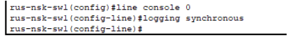

*Рисунок 16 – Синхронный вывод сообщений*

---

### Шаг 17. Увеличение буфера истории
Размер буфера истории команд для консольной сессии увеличен до 256 строк.

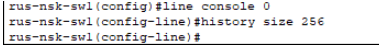

*Рисунок 17 – Размер буфера истории*

---

## Часть 2. Маршрутизация между VLAN на R1

### Шаг 1. Назначение IP интерфейсу Fa0/1
Порт Fa0/1 маршрутизатора R1 получил адрес 40.40.40.1/24.

*Рисунок 18 – IP-адрес порта Fa0/1 R1*

---

### Шаг 2. Создание сабинтерфейсов для VLAN
На интерфейсе Fa0/0 созданы логические подынтерфейсы для VLAN 1–4 с адресами шлюзов: 1.0.0.1, 2.0.0.1, 3.0.0.1, 4.0.0.1.

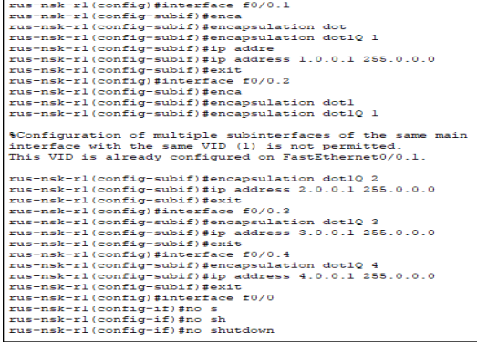

*Рисунок 19 – Конфигурация подынтерфейсов R1*

---

### Шаг 3. Настройка DHCP-сервера
На R1 созданы пулы динамической выдачи адресов для каждой VLAN с диапазонами 1.0.0.100–200, 2.0.0.100–200, 3.0.0.100–200, 4.0.0.100–200.

*Рисунок 20 – Пулы DHCP на R1*

---

### Шаг 4. Проверка связи
С PC0 (IP 3.0.0.100) выполнен ping до адреса 3.0.0.101, подтверждающий работоспособность маршрутизации.

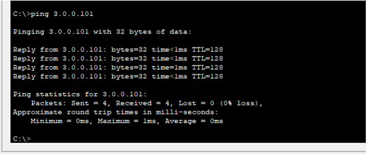

*Рисунок 21 – Успешный ping с PC0*

---

## Часть 3. Многоуровневый коммутатор MLS

### Шаг 1–2. Настройка имени и маршрутизации
Коммутатору MLS присвоено имя `rus-msk-mls`, глобально включена функция IP-маршрутизации.

*Рисунок 22 – Активация ip routing*

---

### Шаг 3. Создание VLAN 100 и 200
На MLS созданы VLAN 100 (Sales_dept) и 200 (IT_dept).

*Рисунок 23 – Таблица VLAN на MLS*

---

### Шаг 4. Назначение портов в VLAN
Порт Fa0/4 переведён в VLAN 100, порт Fa0/5 – в VLAN 200 в режиме access.

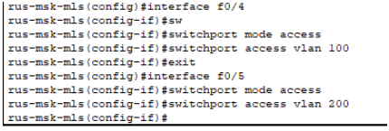

*Рисунок 24 – Конфигурация портов доступа MLS*

---

### Шаг 5. Настройка SVI
Созданы виртуальные интерфейсы VLAN 100 (100.0.0.50/8) и VLAN 200 (200.0.0.50/24).

*Рисунок 25 – Параметры SVI на MLS*

---

### Шаг 6. Настройка интерфейсов L3
Порты Fa0/1, Fa0/2 и Fa0/3 переведены в режим L3 и получили адреса 11.0.0.50/8, 12.0.0.50/8 и 40.40.40.50/24 соответственно.

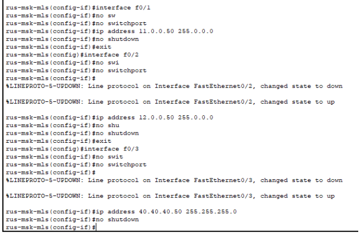

*Рисунок 26 – IP-адресация интерфейсов MLS*

---

### Шаг 7. Проверка работы SVI
С PC6 выполнен ping до адреса 200.0.0.50, подтверждающий доступность интерфейса VLAN 200.

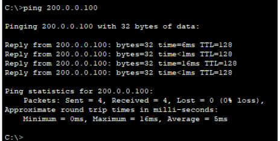

*Рисунок 27 – Успешный ping до SVI*

---

## Часть 4. HSRP в Москве

### Шаг 1–2. Настройка IP-адресов на R2 и R3
Интерфейсам Fa0/0 и Fa0/1 маршрутизаторов R2 и R3 присвоены адреса в соответствии с заданием.

*Рисунок 28 – Адресация на R2*

*Рисунок 29 – Адресация на R3*

---

### Шаг 3. Настройка HSRP
Создана группа HSRP 1 с виртуальным адресом 10.0.0.1. R2 определён как активный маршрутизатор с приоритетом 150 и вытеснением, R3 – как резервный.

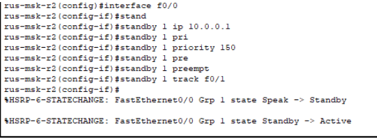

*Рисунок 30 – Параметры HSRP на R2*

.png)

*Рисунок 31 – Параметры HSRP на R3*

---

## Часть 5. Динамическая маршрутизация EIGRP

### Шаг 1. Настройка EIGRP AS 100
На всех маршрутизаторах и MLS активирован протокол EIGRP с номером автономной системы 100. Объявлены все используемые сети.

*Рисунок 32 – Параметры EIGRP на R1*

.png)

*Рисунок 33 – Таблица маршрутизации на R2 и MLS*

---

### Шаг 2. SSH-подключение с сервера
С сервера 10.0.0.100 выполнено подключение по SSH к SW1 (2.0.0.50) с использованием учётной записи `nsk`.

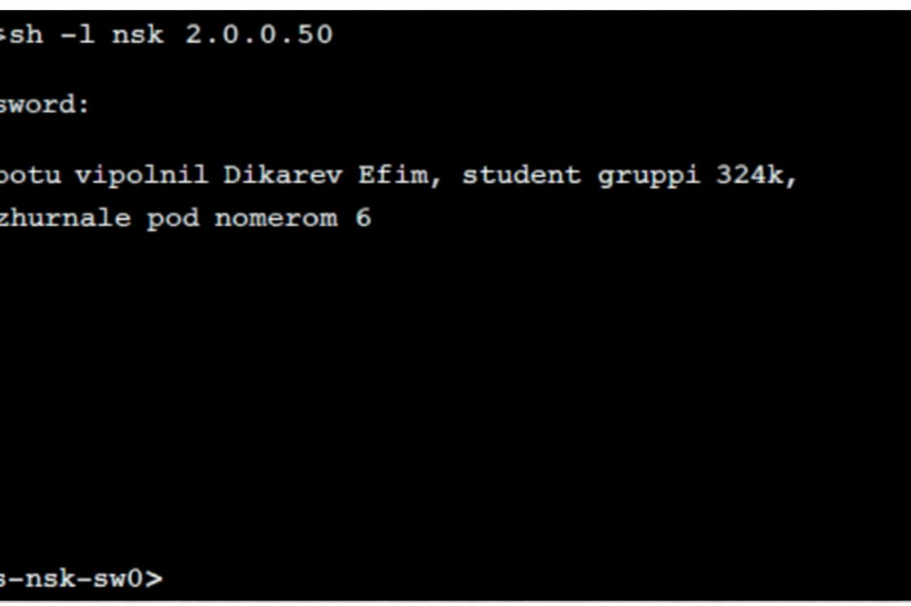

*Рисунок 34 – Подключение по SSH к SW1*

---

### Шаг 3. Проверка доступности SW1
С сервера выполнен ping до адреса 2.0.0.50, подтверждающий сетевую доступность.

*Рисунок 35 – Результат ping с сервера*

---

## Часть 6. Безопасность и фильтрация

### Шаг 1–2. Ограничение доступа к веб-серверу
На R1 настроен ACL, разрешающий доступ к серверу 10.0.0.100 только для хоста с IP 2.0.0.100. Правило применено на входе к сабинтерфейсу VLAN 2.

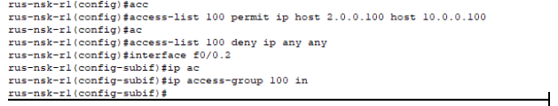

*Рисунок 36 – Список доступа для VLAN 2*

---

### Шаг 3. Запрет ответов на ICMP-запросы
На интерфейсах Fa0/0 R2 и R3 применён ACL, блокирующий входящие ping-запросы.

*Рисунок 37 – Ограничение ICMP на R2*

---

## Часть 7. Туннели и RIPv2

### Шаг 1–2. Создание loopback-интерфейсов
На R1 создан Loopback 1 (192.168.101.1/24), на R3 – Loopback 3 (192.168.103.3/24).

*Рисунок 38 – Интерфейс Loopback 1 на R1*

.png)

*Рисунок 39 – Интерфейс Loopback 3 на R3*

---

### Шаг 3–4. Настройка RIPv2
Между R1 и R3 активирован протокол RIPv2, анонсирующий созданные loopback-сети.

*Рисунок 40 – Конфигурация RIP на R1*

---

### Шаг 5. Организация GRE-туннеля
На R1 и R3 создан туннельный интерфейс Tunnel0 с адресацией 200.200.200.1/24 и 200.200.200.3/24. Источником указан loopback, назначением – loopback соседа.

*Рисунок 41 – Параметры GRE-туннеля на R1*

---

### Шаг 6. Проверка работы туннеля
С R1 выполнен расширенный ping до адреса 192.168.103.3 с указанием источника 192.168.101.1, подтверждающий связность через туннель.

*Рисунок 42 – Успешный ping через GRE-туннель*

---

## Часть 8. Сервисы и управление

### Шаг 1. Настройка NTP и Syslog
На всех устройствах настроена синхронизация времени с NTP-сервером 10.0.0.100 и логирование на тот же сервер.

*Рисунок 43 – Конфигурация NTP и Syslog на R1, R2, R3, MLS*

---

### Шаг 2. Настройка SNMP
На R2 и R3 включён SNMP с паролем `cisco` для операций чтения и записи.

*Рисунок 44 – Параметры SNMP на R2 и R3*

---

### Шаг 3. Настройка Telnet с AAA
На R3 настроена аутентификация через AAA-сервер 10.0.0.100 с резервным использованием локальной базы.

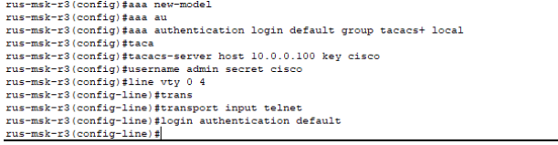

*Рисунок 45 – Конфигурация AAA на R3*

---

### Шаг 4–6. Копирование конфигураций по FTP и TFTP
С R2 выполнена отправка конфигурации на FTP-сервер, с R3 – на TFTP-сервер. Файлы сохранены в соответствующих службах сервера.

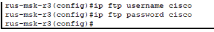

*Рисунок 46 – Передача конфигурации с R2 по FTP*

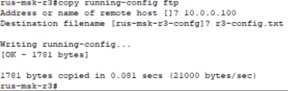

*Рисунок 47 – Передача конфигурации с R3 по TFTP*

---

### Шаг 7. Проверка отсутствия команд boot system
В конфигурации R3 проверено отсутствие команд `boot system`, определяющих источник загрузки IOS.

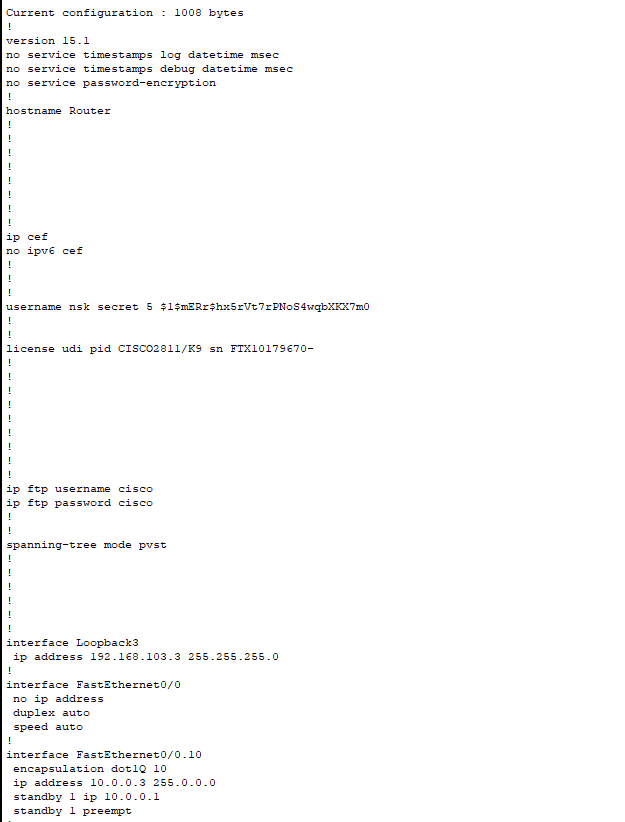

*Рисунок 48 – Отсутствие команд загрузки в конфигурации R3*

---

### Шаг 8. Проверка доступа по имени standby
На R2 создана статическая запись `standby` с адресом 10.0.0.3. Выполнены ping и telnet по этому имени.

.png)

*Рисунок 49 – Результат ping standby*

.png)

*Рисунок 50 – Подключение telnet к R3*

---

### Шаг 9. Восстановление пароля на R3
Выполнена процедура сброса пароля через ROMmon: изменён конфигурационный регистр, загружена конфигурация без паролей, создана новая учётная запись, регистр восстановлен.

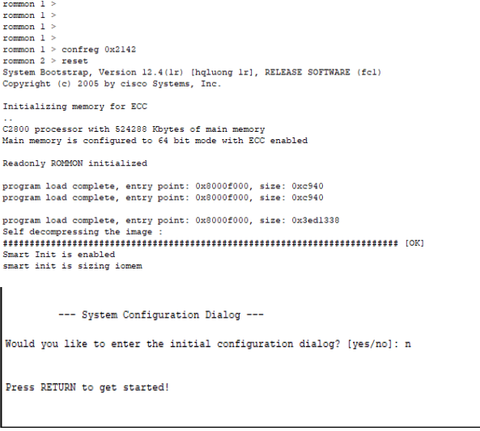

*Рисунок 51 – Прерывание загрузки и вход в ROMmon*

.png)

*Рисунок 52 – Создание новой учётной записи на R3*

---

## Заключение
В процессе выполнения работы выполнены следующие задачи:
- Построение топологии и базовая настройка оборудования;
- Организация VLAN, Trunk, EtherChannel;
- Реализация маршрутизации между VLAN (Router-on-a-Stick);
- Настройка HSRP для отказоустойчивости шлюза;
- Динамическая маршрутизация EIGRP;
- Построение GRE-туннеля и маршрутизация по RIPv2;
- Обеспечение безопасности (Port-Security, ACL);
- Настройка сервисов NTP, Syslog, SNMP, FTP, TFTP, AAA;
- Проверка работы протоколов и доступности устройств.

Все этапы выполнены в соответствии с заданием, сеть функционирует корректно.
